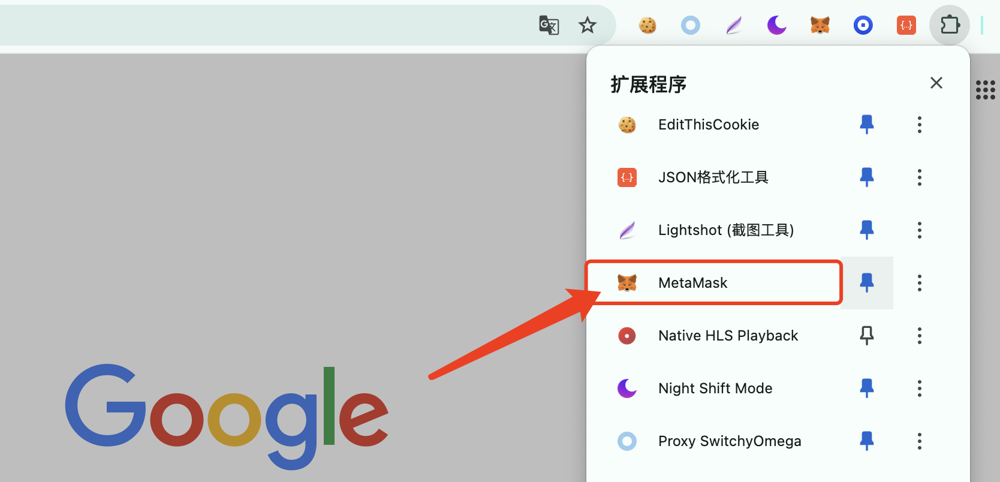

# 小狐狸插件安装教程

#### 一、浏览器安装 

电脑安装谷歌浏览器，下载链接如下：

* Google Chorme windows 64位：https://www.chromedownloads.net/chrome64win/
* Google Chorme windows 32位：https://www.chromedownloads.net/chrome32win/
* Google Chorme mac版：https://www.chromedownloads.net/chrome64osx/

或者使用360软件管家下载chrome稳定版

* 360软件管家 - 宝库 - 搜索chrome - 点击安装按钮右边的向下箭头 - 下载安装包

#### 二、配置MetaMask钱包 

#### **1.安装小狐狸钱包插件** 

&#x20;打开谷歌应用商店[https://chrome.google.com/webstore?hl=zh-CN](https://chrome.google.com/webstore?hl=zh-CN)，搜索框搜索：MetaMask，进行安装。

<figure><figcaption></figcaption></figure>

添加成功之后，将图标固定在谷歌浏览器上方。

<figure><figcaption></figcaption></figure>

安装好后按照提示生成钱包，记得保存好**助记词**，默认是以**太坊钱包**，而且金额为0

<figure><figcaption></figcaption></figure>
