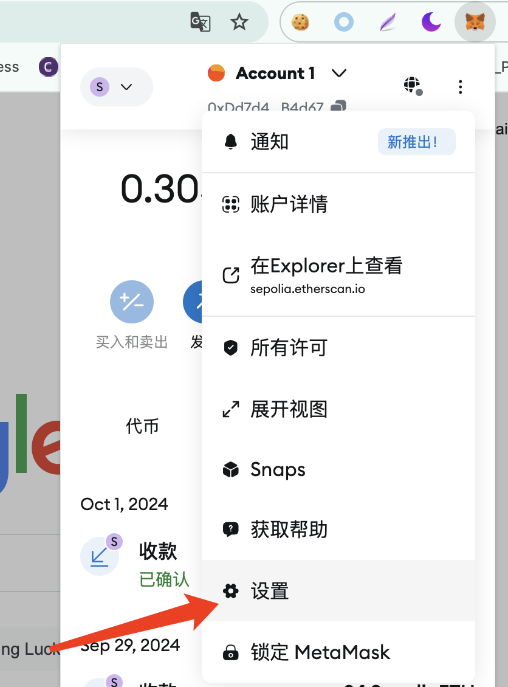

# 小狐狸钱包添加自定义链

小狐狸钱包选择设置===>>>网络===>>>添加网络：

<figure><figcaption></figcaption></figure>

<figure><figcaption></figcaption></figure>

<figure><figcaption></figcaption></figure>

手动添加网络

<figure><figcaption></figcaption></figure>

<figure><figcaption></figcaption></figure>

添加完毕后在小狐狸钱包左上角切换不同网络
